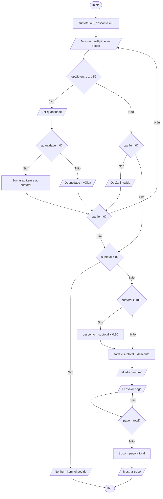

# Desafio Final — Sistema de Pedidos de uma Lanchonete

Código em C: `desafio_final.c`

## Descrição do problema

Uma lanchonete precisa registrar o pedido de um cliente, somar os itens escolhidos, aplicar desconto quando o pedido for grande, receber o pagamento e calcular o troco. Hoje isso é feito à mão, o que gera erros de soma e de troco.

## Entradas necessárias

- Opção do cardápio (1 a 5) ou 0 para finalizar o pedido
- Quantidade de cada item escolhido
- Valor pago pelo cliente

Cardápio usado: 1 - X-Burger (R$ 18,00), 2 - X-Salada (R$ 20,00), 3 - Batata frita (R$ 12,00), 4 - Refrigerante (R$ 6,00), 5 - Suco (R$ 8,00).

## Processamento

1. Repetir o menu até o atendente digitar 0.
2. A cada item: somar a quantidade ao item e somar `quantidade × preço` ao subtotal.
3. Se o subtotal for maior que R$ 100,00, desconto de 10%; caso contrário, sem desconto.
4. Total = subtotal − desconto.
5. Repetir a leitura do valor pago até que seja maior ou igual ao total.
6. Troco = valor pago − total.

## Saídas esperadas

Resumo dos itens (quantidade, nome e valor), subtotal, desconto, total a pagar, troco e mensagem de encerramento. Se nada for pedido, a mensagem "Nenhum item foi pedido."

## Pseudocódigo

```
ALGORITMO LanchoneteDePedidos
VARIAVEIS
    nomes[5], precos[5], quantidades[5]
    opcao, quantidade: inteiro
    subtotal, desconto, total, pago, troco: real
INICIO
    subtotal <- 0
    desconto <- 0
    quantidades <- {0, 0, 0, 0, 0}
    REPITA
        ESCREVA cardápio
        LEIA opcao
        SE opcao >= 1 E opcao <= 5 ENTAO
            LEIA quantidade
            SE quantidade > 0 ENTAO
                quantidades[opcao] <- quantidades[opcao] + quantidade
                subtotal <- subtotal + quantidade * precos[opcao]
            SENAO
                ESCREVA "Quantidade inválida."
            FIMSE
        SENAO
            SE opcao <> 0 ENTAO
                ESCREVA "Opção inválida."
            FIMSE
        FIMSE
    ATE opcao = 0
    SE subtotal = 0 ENTAO
        ESCREVA "Nenhum item foi pedido."
    SENAO
        SE subtotal > 100 ENTAO
            desconto <- subtotal * 0.10
        FIMSE
        total <- subtotal - desconto
        ESCREVA resumo, subtotal, desconto, total
        REPITA
            LEIA pago
        ATE pago >= total
        troco <- pago - total
        ESCREVA troco
    FIMSE
FIM
```

## Fluxograma



## Teste de mesa

| Cenário | Entradas | Subtotal | Desconto | Total | Pago | Troco |
| --- | --- | --- | --- | --- | --- | --- |
| 1 — Pedido pequeno | 2 × X-Burger, 1 × Refrigerante, finalizar, pago 50 | 18×2 + 6 = 42,00 | 0,00 | 42,00 | 50,00 | 8,00 |
| 2 — Pedido com desconto | 4 × X-Salada, 2 × Batata frita, finalizar, pago 100 | 80 + 24 = 104,00 | 10,40 | 93,60 | 100,00 | 6,40 |
| 3 — Pedido vazio | finalizar sem escolher item | 0,00 | — | — | — | "Nenhum item foi pedido." |

Um caso extra de validação: no cenário 1, se o cliente pagar 30, o sistema mostra "Valor insuficiente." e pede o valor de novo até ser igual ou maior que 42,00.

## Explicação da solução

O programa usa três vetores de mesmo tamanho: nomes, preços e quantidades. A posição de cada vetor corresponde ao mesmo item do cardápio, então escolher a opção N acessa a posição N−1 nos três.

Um laço `do-while` mantém o menu aberto até o atendente digitar 0, e cada escolha válida acumula o subtotal. O desconto é decidido por uma condição simples (subtotal acima de R$ 100,00). Outro `do-while` garante que o pagamento cubra o total antes de calcular o troco. Com isso, o sistema evita erros de soma, de desconto e de troco, e rejeita opções, quantidades e pagamentos inválidos.
